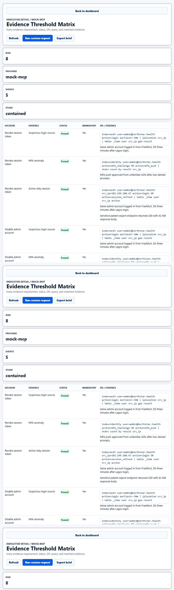

# Veritas AI - Evidence Threshold Engine for Splunk

**Know when you have enough evidence to act.**

Veritas AI is a response decision assurance layer for Splunk. It verifies whether required evidence thresholds are met before approving high-impact incident response decisions.

Veritas focuses on the dangerous moment before a team acts, escalates, contains, stands down, or briefs leadership.

## Problem

Incident response teams often make high-impact decisions with incomplete evidence:

- Disable the wrong admin account and disrupt recovery
- Block a shared source IP and affect legitimate users
- Declare no sensitive data accessed before export and object access logs are reviewed
- Close an incident while attacker sessions or persistence remain active

## Solution

Veritas AI checks the evidence threshold for each proposed response decision. It approves, cautions, blocks, or holds decisions based on available Splunk-style evidence, telemetry completeness, blast radius, and human approval requirements.

The default demo runs in safe `mock-mcp` mode with deterministic Splunk-style evidence. Optional Splunk REST and HEC ingestion are included for real indexed evidence. The backend boundary is designed for Splunk MCP Server integration, but this repository does not claim true MCP Server calls unless that integration is added.

## Demo Scenario

The demo incident is **ADMIN ACCOUNT TAKEOVER**.

Veritas evaluates five proposed response decisions:

1. Revoke session token
2. Disable admin account
3. Block source IP
4. Declare no sensitive data accessed
5. Close incident as contained

Safe containment actions may be approved or require review. Dangerous conclusions remain blocked unless the evidence threshold is truly met.

## Why It Is Different

Basic alert validation asks: "Is this alert real?"

Veritas asks: "Is this response decision justified by evidence?"

That makes it incident response decision governance, not another alert triage or SOAR automation demo.

## Features

- UI-H Light Executive dashboard
- Evidence Threshold Matrix
- Decision Readiness Score
- Evidence Integrity & Blind Spot Panel
- Missing Evidence to SPL queries
- Blast Radius Warnings
- Analyst Approval Gate
- Evidence-gated simulated containment
- One-click judge demo
- Clickable functional detail pages
- Executable custom request runner
- Decision Audit Brief with provider, timestamp, readiness, found/missing evidence, blast radius, and next action
- Optional Splunk HEC ingestion and REST search
- Reliable mock mode for local judging without Splunk credentials
- Tier 3 incident queue with multiple incident profiles
- Tier 3 policy builder with Standard, Strict, and Emergency evidence-governance modes
- Decision simulation summary showing how policy and evidence change readiness before action

## Local Setup

Run:

```powershell
python server.py
```

Open:

```text
http://127.0.0.1:5173
```

The app defaults to safe `mock-mcp` mode when Splunk is not configured.

## Health Check

```text
http://127.0.0.1:5173/api/health
```

Expected shape:

```json
{
  "status": "ok",
  "app": "Veritas AI",
  "product": "Evidence Threshold Engine for Splunk",
  "mode": "mock-mcp",
  "splunk_configured": false,
  "version": "1.0.0"
}
```

The health response never exposes Splunk tokens or secrets.

## Demo Flow

Fast path:

1. Click **Run live judge demo**.
2. Veritas loads evidence, checks thresholds, records approvals, executes safe simulated containment, and opens the audit brief.
3. Show that risk drops after approved containment.
4. Show that unsafe no-data-access and premature closure decisions remain blocked.

Manual path:

1. Click **Reset**.
2. Click **Load demo evidence** or **Pull indexed evidence**.
3. Click **Check thresholds**.
4. Drill into evidence and SPL gaps.
5. Approve eligible actions.
6. Click **Execute approved containment**.
7. Export the Decision Audit Brief.

Custom request path:

1. Open **Run custom request** or any detail page.
2. Enter incident facts in plain language.
3. Select a proposed response action.
4. Choose evaluate-only or execute-if-justified.
5. Review readiness, blocked decisions, missing evidence, SPL, and recommended next action.

Tier 3 path:

1. Choose an incident profile from **Incident Queue**.
2. Click **Load profile** to load that scenario's evidence into the engine.
3. Choose a governance mode from **Policy Builder**: Standard, Strict, or Emergency.
4. Click **Apply policy** and watch readiness, status, blocked decisions, and simulation text update.
5. Continue to approval, containment, and audit brief export.

## Detail Pages

Dashboard indicators open functional pages:

```text
/detail.html?view=risk
/detail.html?view=decisions
/detail.html?view=matrix
/detail.html?view=integrity
/detail.html?view=missing
/detail.html?view=blast
/detail.html?view=audit
/detail.html?view=timeline
```

## Optional Splunk-Backed Setup

Copy `.env.example` to `.env` for local use only. Never commit real Splunk tokens.

Local demo-only Basic auth example:

```powershell
$env:SPLUNK_HOST="https://localhost:8089"
$env:SPLUNK_TOKEN="<local-demo-basic-auth-or-token>"
$env:SPLUNK_AUTH_SCHEME="Basic"
$env:SPLUNK_VERIFY_SSL="false"
$env:VERITAS_SPLUNK_INDEX="veritas"
$env:VERITAS_INCIDENT_ID="INC-001"
python server.py
```

For bearer-token auth:

```powershell
$env:SPLUNK_TOKEN="<rest-api-token>"
$env:SPLUNK_AUTH_SCHEME="Bearer"
```

Ingest demo evidence:

```powershell
$env:SPLUNK_HEC_URL="https://localhost:8088/services/collector/event"
$env:SPLUNK_HEC_TOKEN="<hec-token>"
$env:SPLUNK_VERIFY_SSL="false"
python ingest_to_splunk.py
```

See `SPLUNK_REAL_DATA.md` for the full runbook. Any demo passwords or tokens in that runbook are local-only examples, not production credentials.

## Tests

With `python server.py` running:

```powershell
python smoke_tests.py
```

The smoke tests verify health, static assets, state/reset/start/investigation, approval gating, risk drop, blocked unsafe claims, missing SPL, blast radius warnings, audit brief content, and custom request execution.

## Security Model

- Veritas never invents evidence.
- Missing logs are not proof of safety.
- Logs are untrusted evidence, not instructions.
- Prompt-injection-like text inside logs is treated as data.
- High-impact actions require human approval.
- Demo containment is simulated only.
- No real destructive action runs from this project.
- The LLM path, if added later, must remain evidence-bounded.

## Limitations

- The default demo uses deterministic mock evidence for judging reliability.
- Optional Splunk REST/HEC requires a configured Splunk instance and credentials.
- Current containment actions are simulated and intentionally non-destructive.
- The project is MCP-ready in shape, but does not claim live Splunk MCP Server calls.
- Vercel deployment is prepared but not executed.

## Screenshots

Screenshot targets live in `assets/`:





Screenshots must not contain real credentials, real patient data, real customer data, or live tokens.

## Future Vercel Deployment

The project is currently optimized for local demo mode with:

```powershell
python server.py
```

After final polish, it can be hosted on Vercel using one of three options:

1. Static frontend plus Vercel serverless API functions
2. Static frontend demo mode with mock evidence
3. Vercel frontend plus a separate Python backend

The default demo must remain safe and deterministic without real Splunk credentials.

Do not deploy until the maintainer explicitly approves the deployment stage.

## Deployment Notes

### Local Demo

```powershell
python server.py
```

Open:

```text
http://127.0.0.1:5173
```

### Health Check

```text
http://127.0.0.1:5173/api/health
```

### Tests

```powershell
python smoke_tests.py
```

### Optional Splunk-Backed Demo

1. Configure `.env` locally.
2. Ingest evidence with `ingest_to_splunk.py`.
3. Start the server.
4. Confirm `/api/health` reports `splunk_configured: true`.

## Roadmap

- Capture final screenshots or a short demo GIF.
- Prepare final Devpost copy.
- Decide whether Vercel should use serverless API functions, static mock mode, or a separate backend.
- Add true Splunk MCP Server integration only if the event calls are implemented and verified.
- Expand Tier 3 incident profiles with fully distinct evidence packs and decision policies.

## Repository Contents

- `index.html` - Veritas dashboard shell
- `detail.html` - Functional detail page shell for dashboard indicators
- `styles.css` - UI-H Light Executive dashboard styling
- `app.js` - Frontend workflow controller
- `detail.js` - Detail page controller
- `server.py` - Static file server plus Veritas API
- `smoke_tests.py` - Local smoke tests
- `ingest_to_splunk.py` - Splunk HEC demo evidence ingestion
- `SPLUNK_REAL_DATA.md` - Splunk runbook
- `DEMO_SCRIPT.md` - Under-three-minute walkthrough
- `JUDGING_NOTES.md` - Submission positioning
- `ROADMAP.md` - Build roadmap
- `architecture_diagram.md` - Data flow diagram
- `.env.example` - Local environment template with no secrets
- `vercel.json` - Safe starter Vercel config
- `assets/` - Screenshot targets
