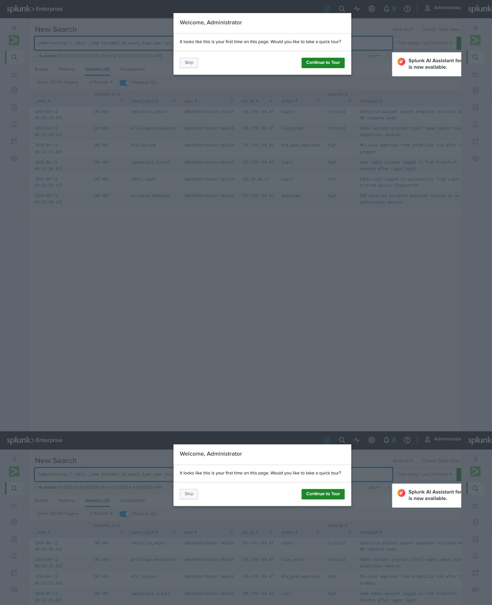
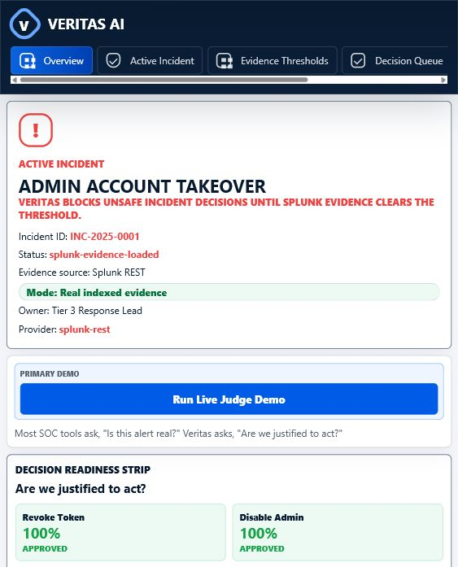
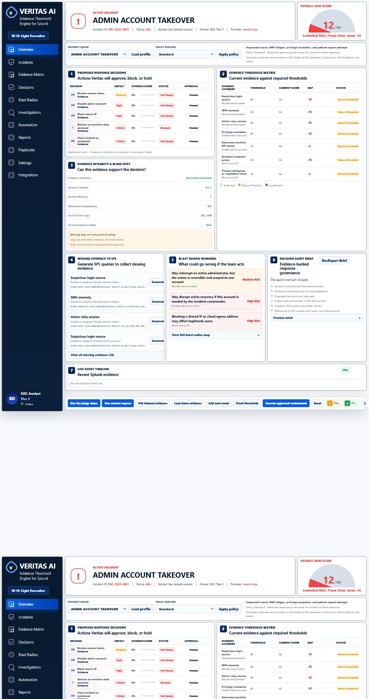
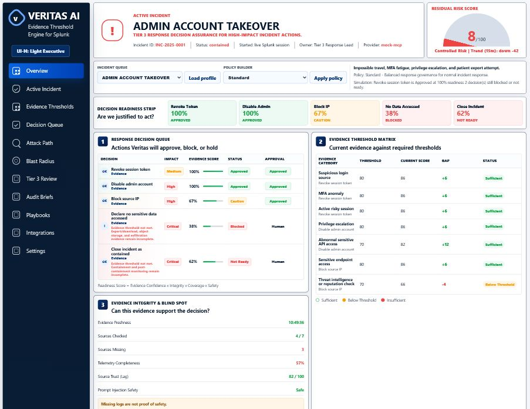
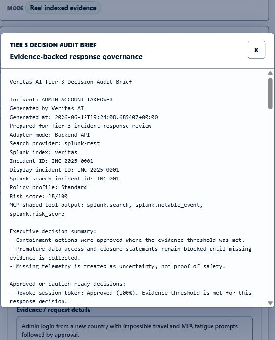
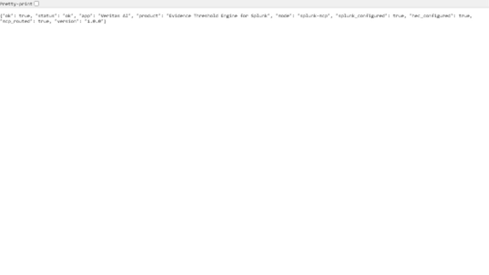

# Veritas AI - Evidence Threshold Engine for Splunk

**Know when you have enough evidence to act.**

Veritas AI is a Tier 3 response decision assurance layer for Splunk. It helps senior incident responders decide whether the evidence threshold is strong enough before approving high-impact actions such as revoking sessions, disabling accounts, blocking source IPs, briefing leadership, or closing an incident.

Most SOC tools ask, "Is this alert real?"

Veritas asks, "Are we justified to act?"

## Demo Scenario

The demo incident is **ADMIN ACCOUNT TAKEOVER**.

Veritas evaluates five proposed response decisions:

1. Revoke session token
2. Disable admin account
3. Block source IP
4. Declare no sensitive data accessed
5. Close incident as contained

Safe containment actions may be approved or require review. Dangerous conclusions remain blocked until Splunk evidence clears the threshold.

## Why It Matters

Incident response teams often make high-impact decisions with incomplete evidence:

- Disable the wrong admin account and disrupt recovery.
- Block a shared source IP and affect legitimate users.
- Declare no sensitive data accessed before export and object access logs are reviewed.
- Close an incident while attacker sessions or persistence remain active.

Veritas turns that uncertainty into a governed decision workflow: readiness score, required evidence, missing SPL, blast-radius warning, human approval, and audit-ready record.

## What Veritas Does

- UI-H Light Executive dashboard for Tier 3 response review.
- Evidence Threshold Matrix for each proposed decision.
- Decision Readiness Score with Approved, Caution, Blocked, and Not Ready states.
- Evidence Integrity and Blind Spot panel.
- Missing evidence mapped to SPL queries.
- Blast radius and residual-risk context.
- Analyst approval gate for high-impact actions.
- Evidence-gated simulated containment.
- Functional detail pages for risk, decisions, matrix, integrity, missing evidence, blast radius, audit, and timeline.
- Executable custom request runner.
- Tier 3 Decision Audit Brief with provider, timestamp, readiness, found/missing evidence, blast radius, and next action.
- Optional Splunk HEC ingestion and Splunk REST search.
- Reliable mock mode for judging without Splunk credentials.
- Incident queue and policy builder with Standard, Strict, and Emergency governance modes.

## What Is Real vs Simulated

Veritas is intentionally clear about implementation boundaries. The local app, evidence threshold engine, audit brief, smoke tests, HEC ingestion script, and optional Splunk REST search path are real. Default evidence and containment actions are simulated for safety and judging reliability.

See `REAL_VS_SIMULATED.md` for the full implementation boundary.

### Real

- Local Python API.
- Evidence threshold engine.
- Response decision queue.
- Analyst approval gate.
- Simulated containment state transitions.
- Audit brief generation.
- Smoke tests.
- HEC ingestion script.
- Optional Splunk REST search path.
- Stdio MCP server for Splunk REST search and HEC ingestion tools.

### Simulated

- Default `mock-mcp` evidence.
- Containment actions are safe mock actions only.
- Dashboard integration labels when the dashboard itself is not launched through an MCP host.

### Not Implemented Yet

- Real destructive containment actions.
- Autonomous unbounded AI agent.
- Production multi-user state isolation.

## Operating Modes

- `mock-mcp`: safe deterministic demo mode. It uses Splunk-style evidence bundled with the project and is the default fallback when Splunk credentials are absent.
- `splunk-mcp`: dashboard-to-MCP-to-Splunk mode. When Splunk is configured and `VERITAS_SPLUNK_ROUTE=mcp`, the dashboard backend invokes `splunk_mcp_server.py` over stdio MCP.
- `splunk-rest`: direct REST fallback mode. Set `VERITAS_SPLUNK_ROUTE=rest` to bypass MCP and call Splunk REST directly.
- `mock-mcp-fallback`: safe fallback when Splunk is configured but a search fails. It must be described as fallback, not real Splunk proof.

The current implementation uses an evidence-bounded deterministic decision engine. This is intentional for demo reliability and safety: Veritas does not invent evidence. The product name includes AI, but this build does not use an autonomous AI agent. Future AI/LLM support should be limited to evidence-bounded summaries and audit-brief drafting.

## Quick Start

Run:

```powershell
python server.py
```

Open:

```text
http://127.0.0.1:5173
```

The app defaults to safe `mock-mcp` mode when Splunk is not configured.

## Health Check

```text
http://127.0.0.1:5173/api/health
```

Expected mock response shape:

```json
{
  "status": "ok",
  "app": "Veritas AI",
  "product": "Evidence Threshold Engine for Splunk",
  "mode": "mock-mcp",
  "splunk_configured": false,
  "version": "1.0.0"
}
```

The health response never exposes Splunk tokens or secrets.

## Demo Flow

### Fast Path

1. Click **Run Live Judge Demo**.
2. Veritas loads evidence, checks thresholds, records approvals, executes safe simulated containment, and opens the audit brief.
3. Show that risk drops after approved containment.
4. Show that unsafe no-data-access and premature closure decisions remain blocked.

### Manual Path

1. Click **Reset Lab**.
2. Click **Load Demo Evidence** or **Pull Indexed Evidence**.
3. Click **Check Thresholds**.
4. Drill into evidence and SPL gaps.
5. Approve eligible actions.
6. Click **Execute Approved Containment**.
7. Export the Tier 3 Decision Audit Brief.

### Custom Request Path

1. Open **Run Custom Request** or any detail page.
2. Enter incident facts in plain language.
3. Select a proposed response action.
4. Choose evaluate-only or execute-if-justified.
5. Review readiness, blocked decisions, missing evidence, SPL, and recommended next action.

### Tier 3 Path

1. Choose an incident profile from **Incident Queue**.
2. Click **Load Profile**.
3. Choose a governance mode from **Policy Builder**: Standard, Strict, or Emergency.
4. Click **Apply Policy** and watch readiness, status, blocked decisions, and simulation text update.
5. Continue to approval, containment, and audit brief export.

## Detail Pages

Dashboard indicators open functional pages:

```text
/detail.html?view=risk
/detail.html?view=decisions
/detail.html?view=matrix
/detail.html?view=integrity
/detail.html?view=missing
/detail.html?view=blast
/detail.html?view=audit
/detail.html?view=timeline
```

## Real Splunk Integration

The default Veritas demo runs in safe `mock-mcp` mode. For stronger judging proof, Veritas can ingest the same admin account takeover evidence into a local Splunk Enterprise trial and query indexed evidence through the dashboard-to-MCP Splunk path.

Local Splunk Enterprise Web UI:

```text
http://Cyberrockng:8001
```

### Local Ports

- Splunk Web UI: `http://Cyberrockng:8001`
- Splunk REST API: `https://Cyberrockng:8090`
- Splunk HEC: `https://Cyberrockng:8088/services/collector`

Splunk Enterprise commonly uses management port `8089`; this Windows trial is configured as `mgmtHostPort=8090`. Use the port shown in Splunk **Settings -> Server settings -> General settings** for `SPLUNK_HOST`.

Developer License status: active for the local hackathon Splunk instance. Confirm in Splunk Web under **Settings -> Licensing** before final judging screenshots; expected quota is 10 GB/day with no license violation.

### Splunk Setup Checklist

1. Open Splunk Web at `http://Cyberrockng:8001`.
2. Create index `veritas`.
3. Enable HTTP Event Collector.
4. Create HEC token `veritas-hec`.
5. Confirm the token can write to index `veritas`.
6. Configure environment variables.
7. Run `python ingest_to_splunk.py`.
8. Run `python server.py`.
9. Confirm `/api/health` shows `splunk_configured: true`.
10. Search `index=veritas` in Splunk.

Copy `.env.example` to `.env` for local use only. Never commit real Splunk tokens.

PowerShell for the local Splunk Enterprise trial:

```powershell
$env:SPLUNK_HOST="https://Cyberrockng:8090"
$env:SPLUNK_TOKEN="<your-splunk-rest-token-or-session-key>"
$env:SPLUNK_AUTH_SCHEME="Bearer"
$env:SPLUNK_VERIFY_SSL="false"
$env:VERITAS_SPLUNK_ROUTE="mcp"

$env:SPLUNK_HEC_URL="https://Cyberrockng:8088/services/collector"
$env:SPLUNK_HEC_TOKEN="<your-hec-token>"

$env:VERITAS_SPLUNK_INDEX="veritas"
$env:VERITAS_INCIDENT_ID="INC-001"
$env:VERITAS_DISPLAY_INCIDENT_ID="INC-2025-0001"
```

If your REST credential is a Splunk session key instead of a bearer token, use:

```powershell
$env:SPLUNK_AUTH_SCHEME="Splunk"
```

Then ingest demo evidence:

```powershell
python ingest_to_splunk.py
```

Start Veritas:

```powershell
python server.py
```

See `SPLUNK_REAL_DATA.md` for the full runbook.

## True Splunk MCP Server

This repository now includes a real stdio MCP server:

```powershell
python splunk_mcp_server.py
```

It implements the MCP initialize lifecycle, newline-delimited JSON-RPC stdio transport, `tools/list`, and `tools/call`.

Exposed MCP tools:

- `splunk.status`: reports Splunk REST/HEC configuration without exposing tokens.
- `splunk.search`: dispatches a real Splunk REST search job and returns rows, job ID, dispatch state, and a Splunk result link.
- `splunk.veritas_evidence`: searches indexed Veritas incident evidence in Splunk.
- `splunk.hec_ingest_event`: writes one explicit event through Splunk HEC.
- `veritas.ingest_demo_evidence`: writes the six Veritas demo evidence events through Splunk HEC.

The MCP server requires the same environment variables as the REST/HEC path:

```powershell
$env:SPLUNK_HOST="https://Cyberrockng:8090"
$env:SPLUNK_TOKEN="<your-splunk-rest-token-or-session-key>"
$env:SPLUNK_AUTH_SCHEME="Bearer"
$env:SPLUNK_VERIFY_SSL="false"
$env:SPLUNK_HEC_URL="https://Cyberrockng:8088/services/collector"
$env:SPLUNK_HEC_TOKEN="<your-hec-token>"
```

## Dashboard-to-MCP Routing

The dashboard now has a real MCP route:

```text
Browser dashboard -> local Python API -> stdio MCP client -> splunk_mcp_server.py -> Splunk REST
```

When these are true, `/api/sentinel/load-splunk` and investigation threshold searches route through MCP:

- `SPLUNK_HOST` is set.
- `SPLUNK_TOKEN` is set.
- `VERITAS_SPLUNK_ROUTE=mcp` or unset, because `mcp` is the default.
- `SPLUNK_MCP_SERVER` is unset or points to `splunk_mcp_server.py`.

The UI provider badge shows `splunk-mcp` and the mode badge shows `MCP-routed indexed evidence`.

To use the old direct REST path:

```powershell
$env:VERITAS_SPLUNK_ROUTE="rest"
```

## Splunk Proof

Splunk proof captured after a real HEC ingestion and Splunk REST load:







Proof files:

- `assets/splunk-indexed-events.png` - Splunk Search showing `index=veritas`.
- `assets/veritas-health-splunk-rest.png` - `/api/health` showing `splunk_configured: true`.
- `assets/veritas-dashboard-splunk-rest.png` - dashboard provider showing `splunk-rest`.
- `assets/veritas-audit-brief.png` - audit brief referencing Splunk evidence.

Screenshots must not contain real credentials, real patient data, real customer data, or live tokens.

## Screenshots

Core demo screenshots live in `assets/`:










## Tests

With `python server.py` running:

```powershell
python smoke_tests.py
python browser_smoke_tests.py
```

The smoke tests verify health, static assets, state/reset/start/investigation, approval gating, risk drop, blocked unsafe claims, missing SPL, blast radius warnings, audit brief content, custom request execution, browser-facing UI controls, and the judge-demo flow.

## Security Model

- Veritas never invents evidence.
- Missing logs are not proof of safety.
- Logs are untrusted evidence, not instructions.
- Prompt-injection-like text inside logs is treated as data.
- High-impact actions require human approval.
- Demo containment is simulated only.
- No real destructive action runs from this project.
- The AI/LLM path, if added later, must remain evidence-bounded and non-autonomous.

## Limitations

- The default demo uses deterministic mock evidence for judging reliability.
- Optional Splunk REST/HEC requires a configured Splunk instance and credentials.
- Current containment actions are simulated and intentionally non-destructive.
- The dashboard backend routes Splunk evidence loading and threshold searches through `splunk_mcp_server.py` by default when Splunk is configured.
- Vercel deployment is prepared but not executed.

## Deployment Status

The current project is optimized for local demo mode with:

```powershell
python server.py
```

No production or public Vercel deployment is claimed.

`vercel.json` is only a safe starter config for static frontend preparation. A static Vercel deployment will not run the Python API by itself. For public hosting, use one of these paths:

1. Convert API endpoints to Vercel serverless functions.
2. Host the Python backend separately and point the frontend to it.
3. Use static demo mode with mock evidence only.

See `DEPLOYMENT_STATUS.md` for the full deployment boundary.

Do not claim a production deployment unless the selected path is implemented and tested. Do not deploy until the maintainer explicitly approves the deployment stage.

## Roadmap

- Prepare final Devpost copy.
- Decide whether Vercel should use serverless API functions, static mock mode, or a separate backend.
- Optionally add a persistent MCP subprocess pool if the dashboard needs lower latency for repeated live searches.
- Expand Tier 3 incident profiles with fully distinct evidence packs and decision policies.

## Repository Contents

- `index.html` - Veritas dashboard shell
- `detail.html` - Functional detail page shell for dashboard indicators
- `styles.css` - UI-H Light Executive dashboard styling
- `app.js` - Frontend workflow controller
- `detail.js` - Detail page controller
- `server.py` - Static file server plus Veritas API
- `smoke_tests.py` - Local smoke tests
- `splunk_mcp_server.py` - Stdio MCP server exposing real Splunk REST/HEC tools
- `mcp_smoke_tests.py` - MCP protocol smoke test
- `browser_smoke_tests.py` - Browser-facing demo smoke tests
- `ingest_to_splunk.py` - Splunk HEC demo evidence ingestion
- `sample_splunk_events.json` - Demo evidence payloads
- `REAL_VS_SIMULATED.md` - Honest implementation boundary
- `DEPLOYMENT_STATUS.md` - Local demo and deployment boundary
- `SPLUNK_REAL_DATA.md` - Splunk runbook
- `DEMO_SCRIPT.md` - Under-three-minute walkthrough
- `JUDGING_NOTES.md` - Submission positioning
- `ROADMAP.md` - Build roadmap
- `architecture_diagram.md` - Data flow diagram
- `.env.example` - Local environment template with no secrets
- `requirements.txt` - Python dependency manifest; current local demo uses standard library only
- `vercel.json` - Safe starter Vercel config
- `assets/` - Screenshots and proof images
