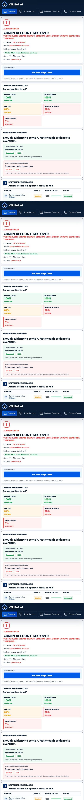

# Veritas Real Splunk Data Runbook

This moves Veritas from mock evidence to Splunk-backed evidence using the installed Splunk Enterprise trial.

Default local judging does not require Splunk credentials. Run `python server.py` with no Splunk environment variables and Veritas uses deterministic `mock-mcp` evidence. Configure Splunk only when you want to demonstrate the HEC and dashboard-to-MCP indexed evidence path.

Never commit real Splunk REST tokens, HEC tokens, passwords, screenshots containing tokens, or a local `.env` file.

## Important Ports

- Splunk Web UI: `http://Cyberrockng:8001`
- Splunk REST management API: `https://Cyberrockng:8090` for this local install (`mgmtHostPort=8090`)
- Splunk HEC ingestion endpoint: `https://Cyberrockng:8088/services/collector`

Use the Web UI only for browser tasks. Do not use port `8001` as the backend API or HEC endpoint.

## Splunk Web Setup

Open:

```text
http://Cyberrockng:8001
```

### 1. Create the index

Go to:

```text
Settings -> Indexes -> New Index
```

Create:

```text
veritas
```

### 2. Enable HEC

Go to:

```text
Settings -> Data Inputs -> HTTP Event Collector
```

If HTTP Event Collector is disabled, enable it from the global HEC settings.

### 3. Create the HEC token

Create a token:

```text
Name: veritas-hec
Default index: veritas
Source type: veritas:evidence
```

Copy the HEC token into a local shell environment variable only. Do not commit it. The ingestion payload also sets `sourcetype` from `VERITAS_SOURCETYPE`, which defaults to `veritas:incident`; if you change that value, change the Veritas REST search setting with it.

## Environment Variables

PowerShell:

```powershell
$env:SPLUNK_HOST="https://Cyberrockng:8090"
$env:SPLUNK_TOKEN="<your-splunk-rest-token-or-session-key>"
$env:SPLUNK_AUTH_SCHEME="Bearer"
$env:SPLUNK_VERIFY_SSL="false"

$env:SPLUNK_HEC_URL="https://Cyberrockng:8088/services/collector"
$env:SPLUNK_HEC_TOKEN="<your-hec-token>"

$env:VERITAS_SPLUNK_INDEX="veritas"
$env:VERITAS_INCIDENT_ID="INC-001"
$env:VERITAS_DISPLAY_INCIDENT_ID="INC-2025-0001"
```

If your REST credential is a Splunk session key, use:

```powershell
$env:SPLUNK_AUTH_SCHEME="Splunk"
```

If you use demo-only Basic auth, set `SPLUNK_TOKEN` to `username:password` and:

```powershell
$env:SPLUNK_AUTH_SCHEME="Basic"
```

## Data Contract

Veritas ingests `sample_splunk_events.json`. The file contains the six admin account takeover evidence events used by the dashboard.

Expected indexed fields:

- `incident_id=INC-001`
- `display_incident_id=INC-2025-0001`
- `event_id=SEC-3001` through `SEC-3006`
- `event_type`
- `evidence_category`
- `source_category`
- `summary`
- `message`
- `user`
- `src_ip`
- `geo`
- `action`
- `severity`
- `query`
- `tags`

## Ingest Evidence Through HEC

Preview the payload first:

```powershell
python ingest_to_splunk.py --dry-run
```

Ingest the events:

```powershell
python ingest_to_splunk.py
```

Expected success:

```text
Ingested 6 Veritas evidence events into Splunk index=veritas
```

The script reads `SPLUNK_HEC_URL`, `SPLUNK_HEC_TOKEN`, `VERITAS_SPLUNK_INDEX`, and `SPLUNK_VERIFY_SSL`. It accepts `https://Cyberrockng:8088/services/collector` and sends event payloads to the HEC event endpoint without printing the token.

## Verify In Splunk Search

Run these from Splunk Web at `http://Cyberrockng:8001`.

Basic verification:

```spl
index=veritas
| table _time incident_id event_type user src_ip action severity message
```

Admin takeover summary:

```spl
index=veritas incident_id="INC-2025-0001" OR incident_id="INC-001"
| stats count by evidence_category, severity, action
```

Attack path:

```spl
index=veritas incident_id="INC-2025-0001" OR incident_id="INC-001"
| sort _time
| table _time event_type evidence_category user src_ip action severity message
```

Veritas REST pull query shape:

```spl
index="veritas" sourcetype="veritas:incident"
| spath
| search incident_id="INC-001"
| table _time event_id incident_id source_category summary user src_ip geo severity query tags
```

## Run Veritas In Splunk Mode

Start the backend after setting the REST variables:

```powershell
python server.py
```

Open:

```text
http://127.0.0.1:5173
```

Confirm health:

```text
http://127.0.0.1:5173/api/health
```

Expected Splunk mode:

```json
{
  "status": "ok",
  "app": "Veritas AI",
  "product": "Evidence Threshold Engine for Splunk",
  "mode": "splunk-mcp",
  "splunk_configured": true,
  "mcp_routed": true,
  "version": "1.0.0"
}
```

Then click:

1. Pull indexed evidence
2. Check thresholds
3. Approve safe actions
4. Execute approved containment
5. Export audit brief

The provider should show `splunk-mcp`, the evidence load should show a Splunk search job ID, dangerous decisions should remain blocked when evidence is incomplete, and the audit brief should reference dashboard-to-MCP-to-Splunk evidence.

## Mock Fallback

To return to safe mock mode in the same PowerShell session:

```powershell
Remove-Item Env:SPLUNK_HOST -ErrorAction SilentlyContinue
Remove-Item Env:SPLUNK_TOKEN -ErrorAction SilentlyContinue
python server.py
```

Expected mock health:

```json
{
  "status": "ok",
  "app": "Veritas AI",
  "product": "Evidence Threshold Engine for Splunk",
  "mode": "mock-mcp",
  "splunk_configured": false,
  "version": "1.0.0"
}
```

## Proof Screenshots For Devpost

Captured after the real Splunk run. Avoid any screen that shows token values.





- `assets/splunk-indexed-events.png` - Splunk Search showing `index=veritas`
- `assets/veritas-health-splunk-mcp.png` - `/api/health` showing `mode: splunk-mcp` and `mcp_routed: true`
- `assets/veritas-dashboard-splunk-mcp.png` - dashboard provider showing `splunk-mcp`
- `assets/veritas-audit-brief.png` - audit brief referencing Splunk evidence

Developer License status: active for the local hackathon Splunk instance. Confirm in Splunk Web under **Settings -> Licensing** before final judging screenshots; expected quota is 10 GB/day with no license violation.

## Honest Positioning

The default dashboard demo runs in safe `mock-mcp` mode with deterministic Splunk-style evidence. Splunk REST, HEC ingestion, and dashboard-to-MCP routing are included for real indexed evidence.

This repository includes a real stdio Splunk MCP server in `splunk_mcp_server.py`. The dashboard backend can invoke it as an MCP client bridge when `VERITAS_SPLUNK_ROUTE=mcp`. The precise claim is dashboard-to-local-API-to-MCP-to-Splunk, not direct browser-to-stdio MCP.
