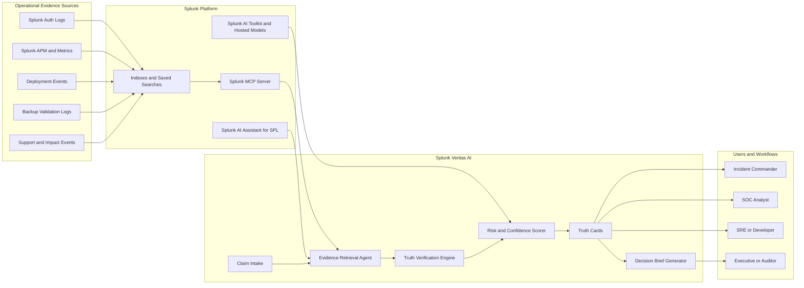

# Architecture Diagram

## Data Flow

1. Users or AI agents submit claims from a war room, SOC queue, change review, or incident thread.
2. Veritas AI converts each claim into evidence questions and SPL search intents.
3. Splunk MCP Server retrieves relevant events, metrics, traces, deployment records, and security logs.
4. The verification engine classifies each claim as supported, contradicted, uncertain, or untestable.
5. The risk scorer estimates confidence and the cost of acting on a false claim.
6. The UI presents Truth Cards with direct evidence links and recommended next actions.
7. The brief generator produces an evidence-backed report for leaders, auditors, and incident records.
