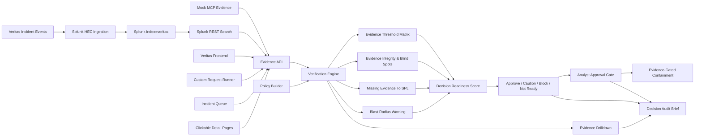

# Architecture Diagram

## Data Flow

1. `ingest_to_splunk.py` sends Veritas incident events to Splunk HEC.
2. Splunk stores them in `index=veritas`, `sourcetype=veritas:incident`.
3. The user clicks **Pull indexed evidence**.
4. The backend runs Splunk REST searches for `incident_id=INC-001`.
5. Veritas maps returned rows into evidence objects.
6. The verification engine evaluates each proposed response decision.
7. Each decision is scored against a required evidence threshold.
8. Analysts drill into threshold evidence and review the SPL/job context.
9. Analysts approve or reject eligible high-impact actions.
10. Veritas executes only approved, evidence-ready containment actions.
11. Users can open functional detail pages for risk, decisions, matrix, blind spots, missing evidence, blast radius, audit, and timeline.
12. Users can feed analyst-provided evidence into the custom request runner for a testable response decision.
13. Tier 3 controls let users switch incident profiles and apply evidence-governance policy modes.
14. Veritas exports a decision audit brief with search, evidence, approval, and action context.

## Core Principle

Veritas does not ask only whether an alert is real. It asks whether the proposed response decision is justified by the available Splunk evidence.

## Deployment Boundary

The current implementation is optimized for local demo reliability with `python server.py`. The frontend now uses same-origin API calls by default, with an optional API-origin override for future hosting. Vercel preparation is limited to safe static configuration and documentation; no production deployment is performed without maintainer approval.
